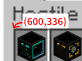
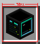

# 概要

このプログラムはクリエティブインベントリからアイテム画像を抽出するものです。
現在はデフォルトのアイテム数、横9 縦5の計45アイテムにのみ対応しています。

# 使い方

1. スクリーンショットを取ります。

	マインクラフトのデフォルトスクショ機能を使うのが良いでしょう

2. GIMPや何らかの画像編集ツールでクリエイティブタブのアイテムがあるピクセルを取得します。

    
	この場合であれば、`600,336`となります。

3. アイテムサイズの取得

	

	この場合だと`72`となります。(マインクラフトのアイテムの縮尺は正方形なので一辺で大丈夫です)

4. コマンドの実行

    あなたの使っているOSに合わせて[release](https://github.com/Ponzu-IKA/MC-Item-Icons/releases)から実行ファイルを取得してきて下さい。

   ```bash
   mc-item-icons-v.... -s 72 --pos 600,336 -f image.png
   ```

   等のようにしたら実行できるはずです

## 使用可能な引数

| name   | required      | arg             | desc     |
|--------|:-------------:|-----------------|----------|
| size   | yes           | -s, --size      | サイズ指定    |
| pos    | yes           | -p, --pos       | 座標指定     |
| file   | dir/fileのうち一つ | -f, --file      | ファイル指定   |
| dir    | dir/fileのうち一つ | -d, --directory | ディレクトリ指定。ディレクトリ内の全てを処理する |
| output | no | -o, --output | 出力フォルダ指定(デフォルトはoutput) |